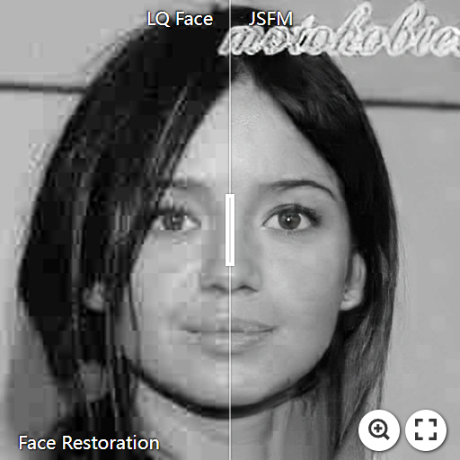

[](https://gitee.com/qianxdong/JSFM-GAN)
 
# JSFMGAN in PyTorch 


[](https://imgsli.com/MzYwNzc3)
[](https://imgsli.com/MzYwNzcz)
[](https://imgsli.com/MzYwNzc2)


## Prerequisites and Installation
- Clone this repository from [Gitee](https://gitee.com/qianxdong/JSFM-GAN.git) .
    ```python
    git clone https://gitee.com/qianxdong/JSFM-GAN.git
    ```
- `nvidia-smi` Check the highest supported CUDA version

- `conda install pytorch==1.5.1 torchvision==0.6.1 cudatoolkit=10.2 -c pytorch`
- `print(torch.cuda.is_available())` Return True if GPU is available.
- Python 3.7, install required packages by `pip install -r requirements.txt`  

## Quick Start

- Download [FFHQ dataset](https://github.com/NVlabs/ffhq-dataset)
- Download [FFHQ-mask-512](https://gitee.com/link?target=https%3A%2F%2Fdrive.google.com%2Ffile%2Fd%2F1eQwO8hKcaluyCnxuZAp0eJVOdgMi30uA%2Fview%3Fusp%3Dsharing),
or Create facial analysis images by ```python scripts\generate_mask.py```

- put the image and mask into ```./dataset/train/FFHQ```

- put pretrain_models weight into ```./pretrain_models```

- Train model
    ```python
    python train.py --gpus 1 --num_threads 8 --batch_size 1 --model jsfmgan --name jsfm --gan_mode hinge --dataset ffhq --dataroot datasets/FFHQ  --srl
    ```
- Uncomment `--continue_train` to resume training.
- It needs at least **`8GB`** memory to train with **`batch_size=1`**. 

## Inference
If you don't want to include parsing parameters at runtime, you can set default parameters in ```options\test_options.py```
### single image
on gpu:
```python 
python scripts/test_enhance_single_unalign.py --model jsfmgan --test_img_path test.jpg --results_dir results --gpus 1
```
on cpu:
```python 
python scripts/test_enhance_single_unalign.py --model jsfmgan --test_img_path test.jpg --results_dir results --gpu -1 --num_threads 0
```
### folder image
#### Aligned
on gpu:
```python 
python scripts/python test_enhance_dir_align.py --model jsfmgan --src_dir testfile --results_dir ret --gpus 1
```
on cpu:
```python 
python scripts/python test_enhance_dir_align.py --model jsfmgan --src_dir testfile --results_dir ret --gpus -1 --num_threads 0
```
#### Unaligned

on gpu:
```python 
python scripts/python test_enhance_dir_unalign.py --model jsfmgan --src_dir testfile --results_dir ret --gpus 1
```
on cpu:
```python 
python scripts/python test_enhance_dir_unalign.py --model jsfmgan --src_dir testfile --results_dir ret --gpus -1 --num_threads 0
```

### video
on gpu:
```python 
python scripts/python test_enhance_video.py --model jsfmgan --src_dir testfile --results_dir ret --gpus 1 --num_threads 1
```
on cpu:
```python 
python scripts/python test_enhance_video.py --model jsfmgan --src_dir testfile --results_dir ret --gpus -1 --num_threads 0
```

## Additional test script
### Artificially synthesized datasets
- Synthesize a dataset using the following command:

   ```python scripts/degrade.py --mode blind --pic_dir pics_path --save_dir save --gray_proportion 0.3 ```
- Changing can obtain images of a single degradation type, such as noise, blur, etc

### Obtain real datasets
- You can download a certain number of facial images from `www.baidu.com` by using the following command
   ```python get_pics.py --keyword face --save_path download```
- Align facial images according to FFHQ
```python scripts/align_and_crop_dir.py --src_dir download --results_dir align --use_cnn_detector```

### Feature visualization
- 在`test_options.py` choose `parse_multi_iter_90000.pth` and `jsfmgan weight`
- ```python get_CAM.py --src_dir test file --results_dir save_path --model jsfmgan --gpu -1```

## Acknowledgement

- This work is inspired by [PSFRGAN](https://gitee.com/zhangzexu/PSFRGAN.git), [HiFaceGAN](https://github.com/Lotayou/Face-Renovation). 

- FFL loss benefit from [Focal Frequency Loss](https://github.com/EndlessSora/focal-frequency-loss).
